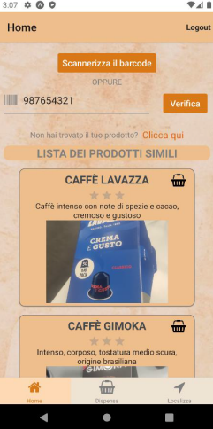
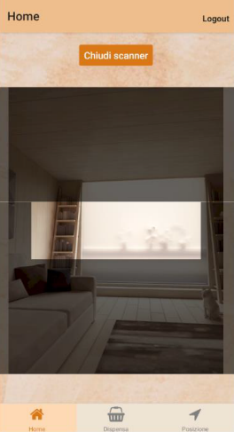

# MOBILE APP - TRACKING MY PANTRY

## A short description

The mobile application (university project) is designed for those who want to keep track of the groceries they buy through their barcode and build up a collaborative database of barcodes that can be used by the community. This means that the app will make use of both a local database and a unique remote knowledge base that will be updated and queried. An API was provided for remote database access and then SQLite was used as the local database. In addition, firebase storage was used for product image management. This application allows the user to manage their virtual pantry by interfacing with both databases.

